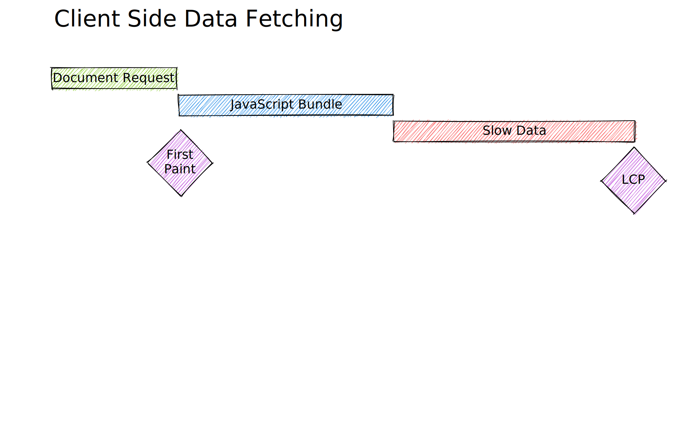
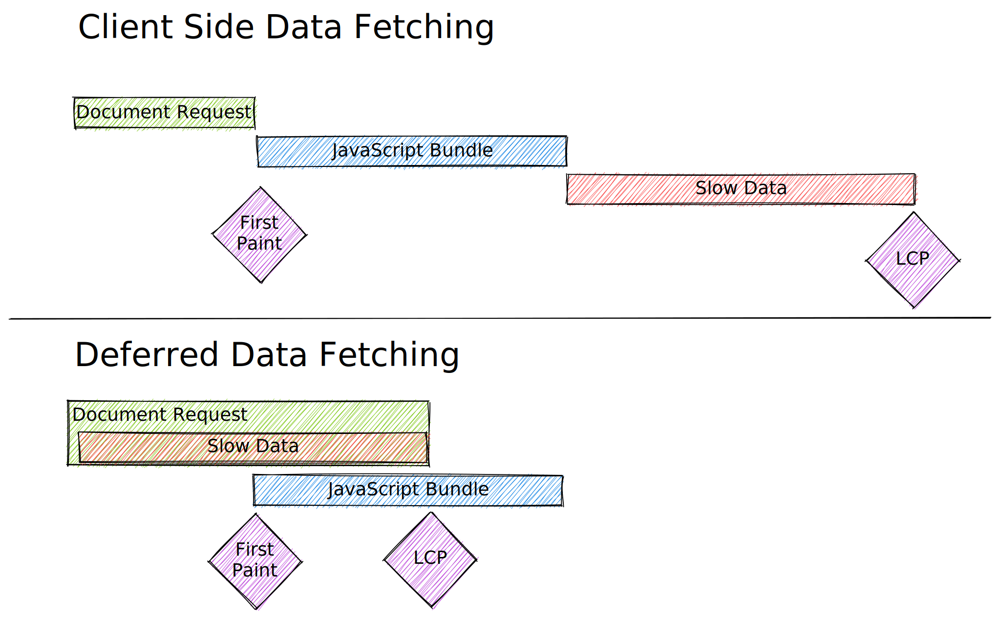

<style>
  code {
    color: rgb(36, 41, 47);
  }
</style>

# "Promises" over the wire

Hi, I'm Jacob Ebey 👋 I work for Shopify on Remix and React Router

---

# Quick Recap

- Remix is a "middle-stack" JavaScript framework
  - A bundler
  - A request handler for your server runtime of choice
  - Lib(s?) that communicate with the server and integrate with the router to build rich client side experiences
- Started closed source with a great community of backers buying licenses
- I committed to come on-board to prepare for the v1 launch June 2021
- v1 open sourced end of November 2021
- October of 2022 announced Shopify acquisition
- Been continuing the work since

---

## If you have a slow data source that would block first paint, what do you do?

---

<style scoped>
  img {
    margin-top: 30%
  }
</style>



---

# `defer()` and `<Await>`

A pair of utilities that allow you to "teleport" a promise over the wire and enables React `<Suspense>` usage both with and without client side hydration.

---



---

```tsx
export function loader() {
  return json({
    message: "I'm critical data and required to render the page!",
    slowNonImportantMessage: await iReturnAPromiseThatResolvesAString(),
  });
}

export default function Route() {
  const data = useLoaderData<typeof loader>();
  return (
    <main>
      <h1>{data.message}</h1>
      <p>{data.slowNonImportantMessage}</p>
    </main>
  );
}
```

---

```tsx
export function loader() {
  return defer({
    message: "I'm critical data and required to render the page!",
    slowNonImportantMessagePromise: iReturnAPromiseThatResolvesAString(),
  });
}

export default function Route() {
  const data = useLoaderData<typeof loader>();
  return (
    <main>
      <h1>{data.message}</h1>
      <Suspense fallback={<p>Loading...</p>}>
        <Await resolve={data.slowNonImportantMessagePromise}>
          {(slowMessage) => <p>{slowMessage}</p>}
        </Await>
      </Suspense>
    </main>
  );
}
```

---

## Handle the error inline

```tsx
export default function Route() {
  const data = useLoaderData<typeof loader>();
  return (
    <main>
      <h1>{data.message}</h1>
      <Suspense fallback={<p>Loading...</p>}>
        <Await
          resolve={data.slowNonImportantMessagePromise}
          errorElement={<p>Something went wrong...</p>}
        >
          {(slowMessage) => <p>{slowMessage}</p>}
        </Await>
      </Suspense>
    </main>
  );
}
```

---

# The magic dust that makes this all work

- `defer()` allows you to surface a promise from your loader to your ui framework
  - document requests
  - client side navigations
- `<Await>` allows you to access the value and handle errors inline
- `<Suspense>` allows you to render a placeholder while waiting for the value

---

# `defer()` time!

---

# `defer()` recap

- No `<Scripts />` / no-hydration cases are handled by React's out-of-order streaming via `<Suspense>`
- Document request hydration handled by `<Scripts>` serializing a `loaderData.routeId.promiseKey = new Promise()` allowing React to hydrate the `<Suspense>` boundary if de-opted by parent component re-renders and re-suspend on the promise until resolution
- Client side navigation handled with a streaming response format

---

# Can I have this in XYZ framework?

Probably, let's build a simple version of it together!

- HTML Templates ``html`<p>hello</p>` `` instead of a framework
- Promise teleported as variable usable with an html template `<script>`
  - `${data.promise}.then()` 
  - `await ${data.promise}`
- Handle both promise resolve and reject

## DIY demo time!

---

# DIY Recap

- Replaced data with promise identifier
- Injected `<script>` to setup promises for the identifiers
- Resolve / reject injected promise with subsequent `<script>` we stream down
- Essentially identical to how Remix document requests work

---

# Thanks!

Find me on Twitter [@ebey_jacob](https://twitter.com/ebey_jacob) or Discord [rmx.as/discord](https://rmx.as/discord)
